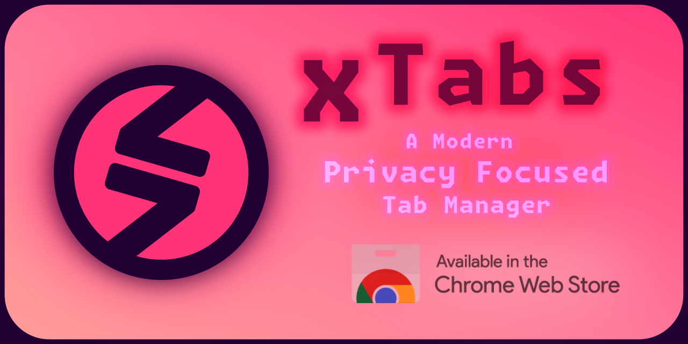

<div align="center">
  
  
  <div>
    <br>
    
    
  </div>
  <h4>A minimal modern browser extension</h4>
  <h5>to securely save and restore tabs</h5>
  <h4>Across browser sessions</h4>
  <h4>No Account, No Storage, No Cloud</h4>
  <h5>No Analytics/Tracking</h5>
</div>

Minimal Chrome extension for managing and sharing tabs across incognito/normal windows.

## Features

- Encrypt/decrypt tab URLs
- Share tabs between modes
- Group tabs by domain
- Copy/paste tab lists
- Import/export tab data
- Zero dependencies

## Usage

```js
// Save current tabs
click 'Save' -> downloads encrypted .bin

// Load saved tabs
click 'Load' -> select .bin -> opens in selected mode

// Share via clipboard
click 'Copy' -> paste text elsewhere
click 'Paste' -> paste encrypted text -> opens tabs
```

## Modes

- `Current` - Active window tabs
- `All` - All window tabs
- `Incognito` - Private window tabs
- `Normal` - Regular window tabs

## Data Format

```
LT@1::220615::W2.T15::base64data
[ver][date][stats ][payload  ]
```

## Development

```bash
# Install
git clone https://github.com/metaory/xtabs
cd xtabs

# Build
npm run build

# Load extension
chrome://extensions -> Load unpacked -> select dist/
```

## Security

- AES-256-GCM encryption
- No data persistence
- No external services
- No tracking/analytics

## License

MIT
